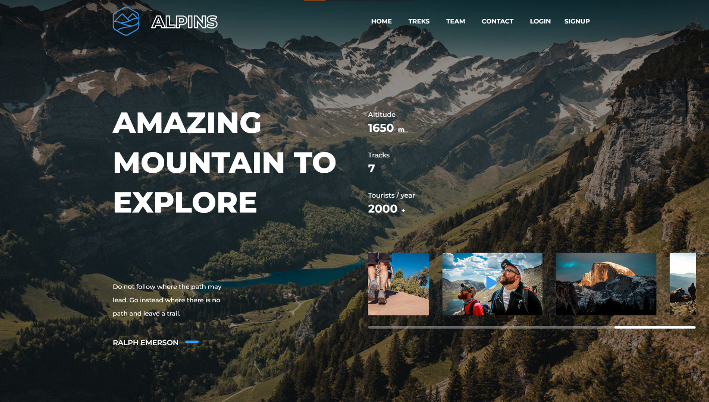
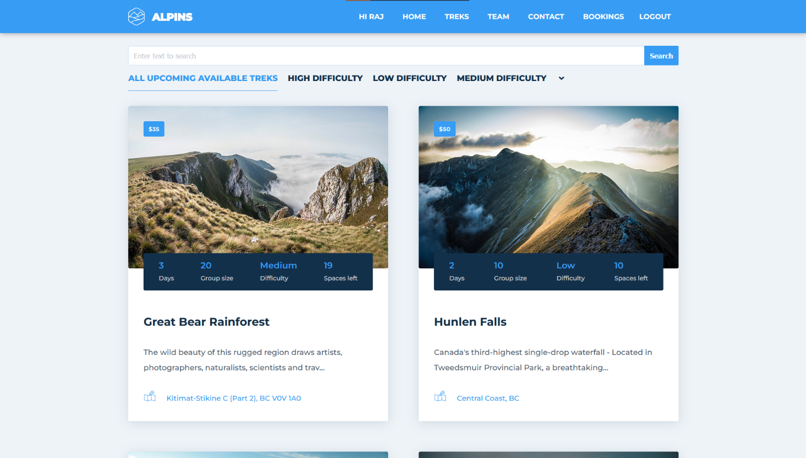
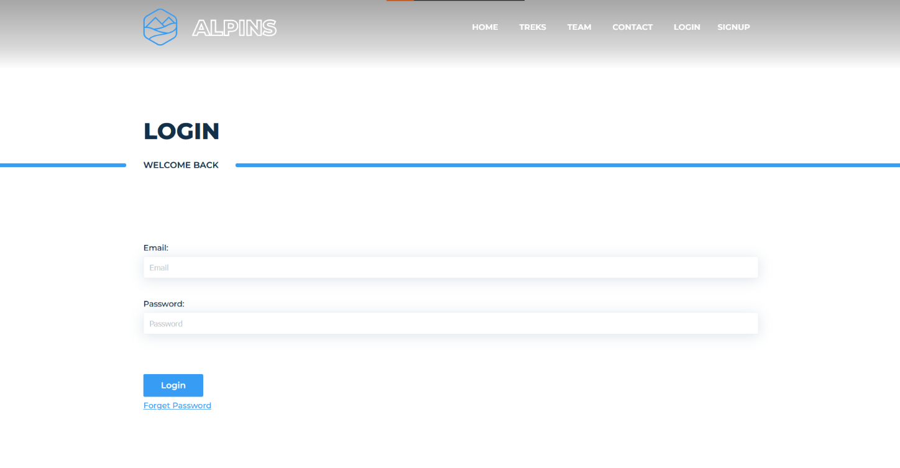

# Alpins

A fullstack Trekking website designed in Django where admin releases new trekking/hiking events and people can join in and attend such adventurous events.

## Features

The trekking website includes the following features:

- A list of guides who are knowledgeable about the area trekkers want to explore
- Comparison of prices and itineraries to find the guide and trek who best fits their needs
- Easy booking of treks through the website
- Job opportunities for local guides who are passionate about sharing their knowledge and love of the outdoors

## Screenshots
Homepage-


Treks-


Login-


## Getting Started

To get started with the website, you will need to have Python 3 and Django installed on your computer. You can install Django using pip:

```
pip install django
```

Once you have Django installed, you can clone the repository and navigate to the project directory:

```
git clone https://github.com/Jaydeep21/TrekkingProject.git
cd trekking-website
```

Next, you will need to create a virtual environment and install the project dependencies:
```
python -m venv env
source env/bin/activate
pip install -r requirements.txt
```

Finally, you can start the development server:
```
python manage.py runserver
```

The website should now be accessible at `http://localhost:8000`.

## Contributing
Contributions are welcome! If you would like to contribute to the project, please fork the repository and create a pull request.

## License

This project is licensed under the MIT License - see the LICENSE.md file for details.

